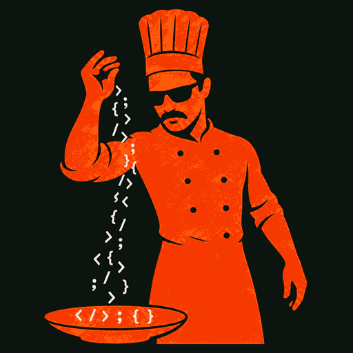
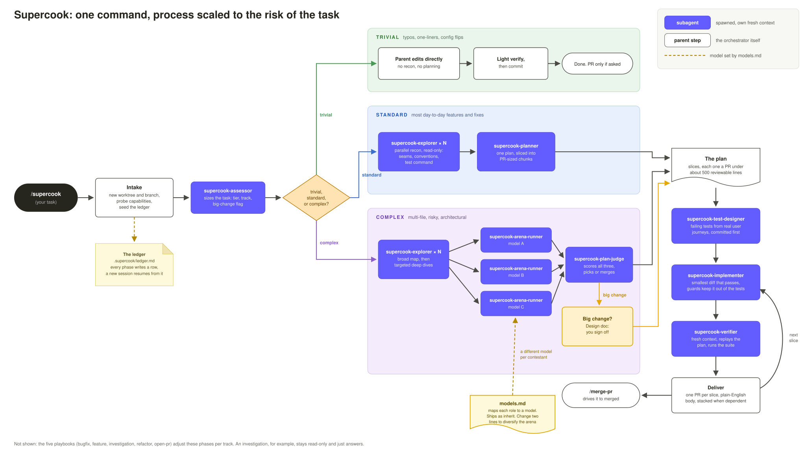

# Supercook

<p align="center">
  
</p>

A development workflow you invoke with one command that scales its own process to the risk of the task.

`/supercook fix the webhook 500s` gets a small, focused fix. `/supercook add rate limiting to the public API` gets architecture alignment, a multi-model planning arena, tests written before implementation, an independent audit, and three reviewable PRs. Same command.

## Contents

- [Why this exists](#why-this-exists)
- [When to use it, and what to expect](#when-to-use-it-and-what-to-expect)
- [The flow](#the-flow)
- [Key principles, and why they work](#key-principles-and-why-they-work)
- [Install](#install)
- [Bring your own models](#bring-your-own-models)
- [What it needs, and what happens without it](#what-it-needs-and-what-happens-without-it)
- [Usage](#usage)
- [Layout](#layout)

## Why this exists

With agents writing code at unprecedented rates, skills to write code that are just focused on writing code aren't good enough. Planning, testing, and reviewing also deserve careful consideration at write time, or they become the bottleneck. `/supercook` is what I landed on after two years of daily tinkering, designed to help you cook efficiently and effectively. Here's why I think it's special:

- **One command intelligently routes based on task/complexity OR just tell it.** How many times are we struggling to find the name of the exact skill, or with the ordering of skills to accomplish a task? Just type /supercook and let the skill cook. It first classifies the complexity and routes to the appropriate playbook: a copy fix stays a two-minute fix, and a risky change gets a multi-model planning arena, test-first development, and an independent audit. If you instead want to skip the classifier and assign complexity yourself, you can.
- **Unlock easy reviews by effortlessly merging bite-size PRs.** Agents made 5k-line PRs effortless to produce, and that is where review breaks down: humans skim, review bots choke, and merges stall for days. Supercook plans work as slices under about 500 reviewable lines and opens one PR per slice, stacked when they depend on each other.
- **Agent language that actually makes sense.** Left alone, agents drift into slop in both directions: "improved error handling" that says nothing, or a wall of text that says too much. Every explanation here names the function, the file, and the ROI impact, so you can judge the work in one read and catch a wrong turn while it is one commit old instead of twelve.
- **Strict test-driven development based on user outcomes.** After a plan is created, a subagent creates tests based on what users actually do rather than a hundred random edge cases. They are committed before implementation, and the implementing agent cannot touch them. At the end of implementation, an independent fresh-context verifier runs that suite before anything ships.
- **Confidence that long-running tasks are done according to plan.** Every phase writes to a ledger on disk, so a context reset or a new session resumes from the record instead of starting over, and no step can be skipped silently. Hours-long tasks actually finish. And when they finish, an independent auditor will compare the agent's work to the initial plan and remediate any gaps.

## When to use it, and what to expect

Use it for anything development related: bugs, features, investigations, refactors, tests, performance work, and turning existing changes into a PR. Specific playbooks will be progressively inserted into context as needed per task.

One command does not mean one heavyweight process. Supercook classifies the task first, then scales ceremony to the risk:

- **Trivial.** Work directly, verify, done. No exploration phase, no arena, no test ceremony. A copy fix stays a copy fix. The one thing that can still fire here is architecture alignment, because a two-line change can still alter an interface other people depend on.
- **Standard.** Targeted exploration, a short plan, tests for the real user journeys, surgical implementation, an independent verification pass, and usually one reviewable PR. Most work lands here.
- **Complex.** Everything above plus a broad codebase map, architecture alignment when the approach needs sign-off, three models planning in parallel with a judge picking or merging, tests committed per slice, verification before every PR, and multiple coherent PRs.

Tracks skip what does not apply. An investigation stays read-only and produces an answer rather than a PR, and it writes nothing to your repo at all. `open-pr` skips planning and implementation, but still verifies the diff and runs the suite before opening. A refactor starts by pinning current behavior with tests.

> Use Supercook for anything development-related. Tell it the outcome you want; it decides how much process the work deserves. Small tasks stay small. Normal changes get a focused plan, implementation, verification, and usually one reviewable PR. Large or risky changes add architecture alignment, deeper exploration, test-first development, independent review, and multiple coherent PRs. You can expect visible progress in the ledger, no silently skipped work, and a short outcome-focused handoff.

## The flow



Purple chips are subagents, each spawned with a fresh context window and a fixed contract. The three bands are the assessor's verdict, and everything converges on the shared tail at the right, where each slice of the plan exits as its own PR. The dashed lines are `models.md` deciding which model a role runs on at launch.

## Key principles, and why they work

**Explanations name the file, the change, and the real consequence.** Written like a sharp junior engineer who just read the code, not like a changelog. "We changed `handleWebhook` in `src/api/webhook.ts` because it still referenced a `retryCount` variable the queue rewrite deleted, so any real webhook would have thrown and taken the server down." Not "improved error handling". This is the principle that makes the rest checkable, so it sits at the top of the skill. An opinionated style choice, not a research finding.

**Subagents with clean context and terse return contracts.** Each role gets an objective, inputs, an effort budget, boundaries, and a fixed output shape, so results stay small and the orchestrator's context stays usable. ([Anthropic on multi-agent systems](https://www.anthropic.com/engineering/multi-agent-research-system))

**The ledger as external memory.** Every phase and every skip is written to a file, so context resets and new sessions resume from the record rather than from a guess. ([Anthropic on context engineering](https://www.anthropic.com/engineering/effective-context-engineering-for-ai-agents), the structured note-taking pattern)

**Ceremony scales with complexity.** Single agent first, the arena only when the task pays for it. ([Building Effective Agents](https://www.anthropic.com/engineering/building-effective-agents), [OpenAI's practical guide to building agents](https://cdn.openai.com/business-guides-and-resources/a-practical-guide-to-building-agents.pdf))

**The arena plus a judge** is parallelization combined with the evaluator-optimizer pattern: three independent plans, then one agent picking or merging with stated provenance. ([Building Effective Agents](https://www.anthropic.com/engineering/building-effective-agents))

**Effort budgets and boundaries in every delegation.** Agents over-invest and under-invest without an explicit scale, which Anthropic reports as their most common multi-agent failure mode. ([Anthropic on multi-agent systems](https://www.anthropic.com/engineering/multi-agent-research-system))

**Progressive disclosure.** `SKILL.md` stays lean and links one level deep, so a phase guide only enters context when that phase runs. ([Anthropic on Agent Skills](https://www.anthropic.com/engineering/equipping-agents-for-the-real-world-with-agent-skills))

**Action-risk tiers.** Read-only actions run, reversible writes run and get logged, irreversible ones ask every time. ([OpenAI's practical guide to building agents](https://cdn.openai.com/business-guides-and-resources/a-practical-guide-to-building-agents.pdf))

**Test-driven, with the suite protected.** Failing tests are committed first, the implementing agent is forbidden from touching them, and the orchestrator restores any test file that gets modified anyway. That last part matters: an instruction alone does not stop an agent bending a test until it passes. ([Cursor's agent best practices](https://cursor.com/blog/agent-best-practices))

**Boundaries are enforced, not requested.** Every rule that matters has a check that runs after the agent returns. Prompts express intent; the checks are what make it a control.

**Opinionated style choices**, with no research behind them and no pretense otherwise: surgical diffs, PRs under about 500 reviewable lines, keep going wherever host permissions allow, and no em dashes anywhere.

## Install

This repo is its own Cursor marketplace, so the shortest path is to add it once and install from Customize:

```bash
cursor-agent plugin marketplace add https://github.com/hsaab/supercook
```

Open Customize in the sidebar, find **Supercook** under `supercook-marketplace`, and install it. When new commits land, pull them in with:

```bash
cursor-agent plugin marketplace update supercook-marketplace
```

If you would rather have a checkout you can edit, install it locally instead:

```bash
git clone https://github.com/hsaab/supercook.git ~/Apps/supercook
ln -s ~/Apps/supercook ~/.cursor/plugins/local/supercook
```

Either way, reload the window, then confirm you see one skill (`supercook`) and eight agents (`supercook-assessor`, `-explorer`, `-planner`, `-arena-runner`, `-plan-judge`, `-test-designer`, `-implementer`, `-verifier`).

If the loader rejects the symlink, clone directly into `~/.cursor/plugins/local/supercook` instead, and update with `git pull`.

One thing to know before the first run: without worktree support it works on your current branch, and in that case it needs a clean tree. It will say so rather than stashing anything.

The marketplace above is one you add to your own account. It is not a listing in the official Cursor Marketplace, which is a separate submission step.

## Bring your own models

Seven roles, one line each: the assessor group, the three arena contestants, the plan judge, the implementer, and the explorer. Every role ships as `inherit`, meaning it uses whatever model is driving your session, with suggested slugs commented next to each role in [skills/supercook/models.md](skills/supercook/models.md).

Put your choices in `~/.supercook/models.md`, not in the plugin. A marketplace install lives in a commit-pinned cache directory that the next update replaces wholesale, so edits made inside the plugin do not survive `plugin marketplace update`. The home file does, and it applies to every repo you run in.

```bash
mkdir -p ~/.supercook
curl -fsSL https://raw.githubusercontent.com/hsaab/supercook/main/skills/supercook/models.md -o ~/.supercook/models.md
```

Then uncomment the roles you want. Roles you leave alone fall back to the shipped default, so a home file that sets two arena slots and nothing else changes exactly those two.

At the start of every run the orchestrator merges the two files, validates each slug against the models your session actually offers, and falls back to inherit with a note in the ledger if your plan does not carry one. Nothing breaks and nothing is guessed.

**The one edit worth making:** get three different model families into the arena. Three contestants on one model mostly agree with themselves, and the disagreement is the entire value of a cook-off. Setting `arena-b` and `arena-c` to two other families is enough, since `arena-a` left on `inherit` contributes whatever model is already driving your session.

## What it needs, and what happens without it

Happiest with git, GitHub plus an authenticated `gh`, worktree support, and a runnable test suite. It degrades rather than fails without them:

| Missing | What happens |
|---|---|
| GitHub or `gh` | Stops at a pushed branch, with the PR body written to the run folder |
| A test runner | Tests become an executable verification recipe the verifier runs |
| Worktrees | Works on the current branch, after saying so, and requires a clean tree |
| git | Works in place, delivers a summary and the diff |
| The plugin's agents | Roles run inline from the agent file bodies |

**One limit worth knowing.** Run artifacts live in `.supercook/` in your repo, untracked, excluded via git's local exclude file rather than your `.gitignore`. They survive new sessions in the same checkout. They do not travel to another machine or a cloud agent unless you deliberately commit the ledger.

## Usage

```
/supercook <what you want>
/supercook plan only <what you want>      # stop after the plan
/supercook no PR <what you want>          # implement and verify, do not open a PR
/supercook no commits <what you want>     # leave the changes uncommitted
/supercook keep ledger <what you want>    # commit the ledger so another machine can resume
/supercook <what you want> and merge it   # carry on through the merge
/supercook merge PR 412                   # drive an existing PR to merged, nothing to build
```

Merging never happens unless you ask for it. Without that ask a run ends at an open PR, and a PR that looks mergeable is not an ask.

Playbooks, routed automatically from the assessment:

| Track | What it does differently |
|---|---|
| bugfix | Reproduces first, proves the root cause, lands a failing repro test before the fix |
| feature | Names the data shape before the logic, tests real journeys, full pipeline |
| investigation | Read-only, cited answer, no plan or tests or PR, and nothing written to your repo |
| refactor | Pins current behavior with characterization tests, reroutes if behavior changes |
| open-pr | No planning or implementation, but the diff is still verified, for work already in the tree |
| merge | Drives an existing PR to merged whatever state it is in: conflicts, review comments, broken CI, stalled checks, stacks |

## Layout

```
.cursor-plugin/               plugin manifest, plus the marketplace manifest for this repo
agents/                       eight discoverable subagents, all supercook- prefixed
assets/                       the pipeline diagram embedded above
skills/supercook/
  SKILL.md                    principles, pipeline, routing, autonomy
  models.md                   the default roster, overridden by ~/.supercook/models.md
  agents.md                   launch contracts and the parent-side guards
  pipeline/                   nine guides for the ten phases, loaded when the phase runs
  playbooks/                  one per track, merge included
```

## License

MIT
