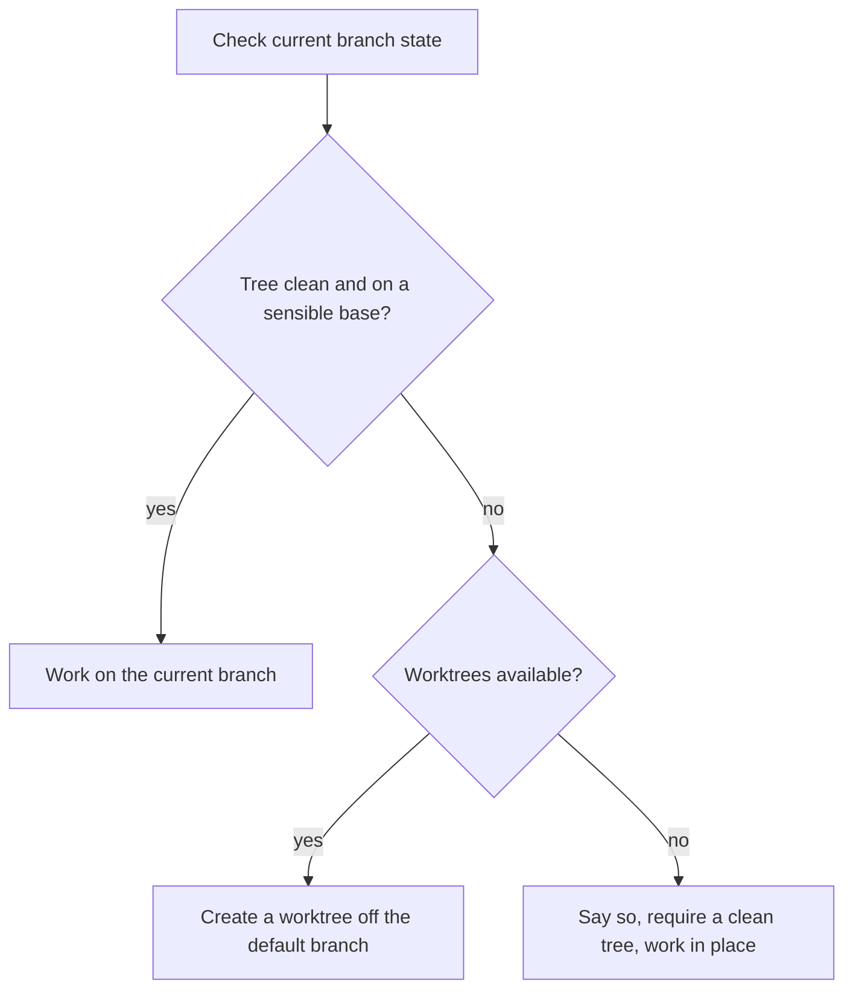

# Phase 0: intake

Four steps, in this order. The order is not cosmetic: doing them out of sequence is how a ledger ends up in a directory the run abandons.

1. [Probe capabilities](#1-probe-capabilities)
2. [Decide the working tree](#2-decide-the-working-tree)
3. [Fix run identity](#3-fix-run-identity)
4. [Seed the ledger](#4-seed-the-ledger)

## 1. Probe capabilities

The rest of the workflow assumes git, a remote host, worktrees, and a test suite. Check rather than assume, and record what you find. Every missing capability has a degraded path, listed at the bottom of this file.

```bash
git rev-parse --is-inside-work-tree 2>/dev/null          # git at all?
git remote get-url origin 2>/dev/null                    # a remote?
gh auth status 2>&1 | head -3                            # GitHub, authenticated?
git worktree list 2>/dev/null                             # worktrees usable?
```

Also determine, without a separate agent launch:

- **The test command.** Look at the `scripts` block, the CI config, or a test runner config file. Do not guess from the language.
- **Whether the supercook agents are installed.** If they are not, every role runs inline from its agent file body. See the fallback section in [../agents.md](../agents.md).
- **Which model slugs in [../models.md](../models.md) are valid** in this session. Uncommented slug that is not available means inherit and log.

Write one capability line to the ledger header:

```
capabilities: git yes | host github (gh authed) | worktrees yes | tests `pnpm vitest run` | PRs yes
```

## 2. Decide the working tree

Do this before creating any file, so the ledger is born inside the tree the run will actually use.



Unrelated uncommitted or unpushed work is the case worktrees exist for. Do not stash someone's work and do not commit it into your run.

**The merge track skips this decision.** The PR's branch already exists, so there is nothing to create: check it out with `gh pr checkout <n>` and work there. No worktree and no new branch. See [../playbooks/merge.md](../playbooks/merge.md).

```bash
git worktree add ../<repo>-<slug> -b supercook/<slug> origin/<default-branch>
```

Creating a worktree is a reversible write, so it may need host approval. Ask once with the reason, log the answer, and continue. Never assume it.

## 3. Fix run identity

Resume depends entirely on this, so write it down before anything else happens.

- **run-id**: `<YYYY-MM-DD>-<slug>-<4 random chars>`. The random suffix is what keeps two runs on the same task apart.
- **repo**: the remote URL when one exists, else the output of `git rev-parse --show-toplevel`.
- **branch** and **worktree path**.
- **done**: the checkable predicate that ends this run. Write it as something you could test, not as an aspiration.

## 4. Seed the ledger

**Skip this step entirely on the investigation track**, and on any request that is explicitly read-only. Those runs keep the record in the todo list instead, which satisfies the same purpose without writing to someone's repo during a read-only ask. See [../playbooks/investigation.md](../playbooks/investigation.md). Steps 1 through 3 still run, minus the worktree.

Otherwise: create `.supercook/<run-id>/` in the chosen tree, then write `ledger.md` with the header, every phase as an unchecked row, and the routed playbook's steps copied in verbatim. Format and lifecycle rules live in [ledger.md](ledger.md).

**The merge track does not get the investigation exception.** It changes the repo and it can span sessions while checks run, so it needs the record more than most runs, not less. Seed the ledger, with the target PR number in the header.

Keep the run folder out of git without touching `.gitignore`:

```bash
EXCLUDE=$(git rev-parse --git-path info/exclude)
grep -qxF '.supercook/' "$EXCLUDE" 2>/dev/null || printf '\n.supercook/\n' >> "$EXCLUDE"
```

Use `git rev-parse --git-path`, never a literal `.git/info/exclude`. A linked worktree has a `.git` **file**, not a directory, so the literal path does not exist there and a plain append would create a stray file that excludes nothing.

Three things about that write. The `grep -qxF` guard is what makes it idempotent, since this runs once per run and the entry only needs to exist once. The leading newline in `printf` protects against an exclude file that does not end in one, which would otherwise glue the entry onto the previous line and break both. And the path resolves to the **shared** exclude file, so the entry covers every worktree of the repo and outlives this run. That last part is acceptable, since it is one line in a file git never commits, but it should not be a surprise.

Skip the write entirely when the probe says this is not a git repo.

Finally, mirror the phase rows into the todo list so progress is visible live.

## Degraded paths

Announce the degradation in one line, log it, and continue. Never fail the run over a missing capability.

| Missing | What changes |
|---|---|
| git | No worktree, no branch, no PR. Work in place, keep the run folder in the system temp dir, deliver a summary plus the diff. |
| GitHub, or `gh` not authenticated | Phases 0 through 7 run unchanged. Delivery stops at a pushed branch or a local commit series, with the PR body written into the run folder to paste wherever it is needed. |
| Worktree support | Say so, require a clean tree, work on the current branch. |
| A runnable test suite | Test-first becomes verification-first. The test designer writes an executable verification recipe into the plan, and the verifier runs that. The journey thinking survives; only the assertion mechanism changes. |
| Write access | Investigation track only, since nothing can ship. Same no-file behavior as that track. |
| The supercook agents | Roles run inline from the agent file bodies. |
| A valid model slug | Inherit, log once, continue. |
| A PR template, or one that is mandatory | The three PR body sections become the minimum content and get fitted into the template's fields rather than replacing them. Check for `.github/pull_request_template.md` during the probe. |
