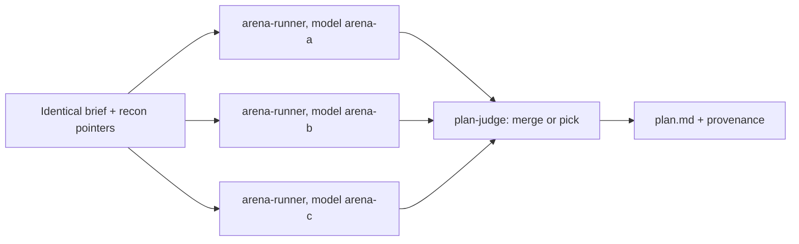

# Phase 4: plan

The plan is a contract. Slices are PRs. Sizing happens here, because a finished monolithic diff is the worst possible place to discover it should have been three PRs.

## Contents

- [Standard tier: one planner](#standard-tier-one-planner)
- [Complex tier: the arena](#complex-tier-the-arena)
- [Slices are PRs](#slices-are-prs)
- [Notify and continue](#notify-and-continue)

## Standard tier: one planner

Launch `supercook-planner` with the task, the recon pointers, the Design Doc if one exists, and the slice budget. It writes `plan.md`. One pass, no exploration.

An arena on standard work burns three model calls to confirm what one already knew. Do not.

## Complex tier: the arena



Launch all three in parallel. The brief is **identical**; the only difference is the model. That is the whole experiment: same question, different reasoning, and the disagreements are the signal.

Each candidate writes its own file in the run folder and returns its approach plus the one decision it is least sure about. When two candidates are unsure about the same decision, that is the real risk in this task, and the final plan has to face it directly.

Then `supercook-plan-judge` reads all three and writes `plan.md`. Merging is common and good when candidates are strong in different places. Picking one outright is also fine. Stitching incoherent plans together to seem fair is not.

The judge enforces slice sizing as a hard gate, so an oversized plan cannot survive the arena.

## Slices are PRs

A slice is one shippable PR: it leaves the default branch working, it carries its own verification, and a reviewer understands it without reading the next slice.

**Cut along natural seams**, in dependency order. Adapt this shape to the task rather than applying it mechanically:

1. Data shape and types
2. Core logic
3. Wiring and entry points
4. Interface or cleanup

**Budget: under 500 reviewable lines per slice.**

Reviewable means additions plus deletions of human-authored code, measured from the merge base, excluding lockfiles, generated code, vendored code, and snapshots:

```bash
git diff --numstat "$(git merge-base HEAD "$BASE")"
```

Two things about that number. `--numstat` scores a rewritten line as one addition plus one deletion, so 500 is roughly 250 rewritten lines or 500 brand new ones. And every slice carries two totals: the **reviewable** count that the budget applies to, and the **raw** count the reviewer actually sees. Generated files still cost review attention even when they do not count against the budget.

Estimate each slice from the recon pointers. A slice that cannot honestly be estimated under budget gets split here.

### The cohesion exception

Cohesion outranks the number. A slice stays whole when splitting it would leave a broken or unsafe intermediate state on the default branch:

- A migration and the code that writes the new column.
- A security fix and its call sites.
- A rename that only compiles once every reference moves.

Write `exception: <reason>` on that slice and log it. An unexplained oversized slice is a defect; an explained one is a judgment call the reviewer can see.

## Notify and continue

When `plan.md` lands:

1. Append every slice to the ledger under `implement`.
2. Send the user a short summary: the approach in a sentence, the slice list, the total estimate.
3. Keep working.

Do not stop and wait for approval on the plan. The summary is a notification, not a gate. The exceptions are the sanctioned pauses in `SKILL.md`, and a Design Doc on a big change is the one that applies here, and it happens in phase 3 before planning rather than after.
