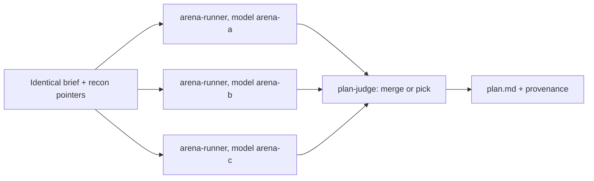

# Phase 4: plan

The plan is a contract. Slices are PRs. Sizing happens here, because a finished monolithic diff is the worst possible place to discover it should have been three PRs.

## Contents

- [Standard tier: one planner](#standard-tier-one-planner)
- [Complex tier: the arena](#complex-tier-the-arena)
- [Supplied plan: the optimizer](#supplied-plan-the-optimizer)
- [UI contract gate](#ui-contract-gate)
- [Slices are PRs](#slices-are-prs)
- [Notify and continue](#notify-and-continue)

## Standard tier: one planner

Launch `supercook-planner` with the task, the recon pointers, the Design Doc if one exists, the resolved UI brief when one exists, and the slice budget. It writes `plan.md`. One pass, no exploration.

An arena on standard work burns three model calls to confirm what one already knew. Do not.

## Complex tier: the arena


```mermaid
flowchart LR
    brief["Identical brief + recon pointers"] --> a["arena-runner, model arena-a"]
    brief --> b["arena-runner, model arena-b"]
    brief --> c["arena-runner, model arena-c"]
    a --> judge["plan-judge: merge or pick"]
    b --> judge
    c --> judge
    judge --> plan["plan.md + provenance"]
```

Launch all three in parallel. The brief is **identical**; the only difference is the model. That is the whole experiment: same question, different reasoning, and the disagreements are the signal.

Each candidate writes its own file in the run folder and returns its approach plus the one decision it is least sure about. When two candidates are unsure about the same decision, that is the real risk in this task, and the final plan has to face it directly.

Then `supercook-plan-judge` reads all three and writes `plan.md`. Merging is common and good when candidates are strong in different places. Picking one outright is also fine. Stitching incoherent plans together to seem fair is not.

The judge enforces slice sizing as a hard gate, so an oversized plan cannot survive the arena.

## Supplied plan: the optimizer

The `implement-plan` track does not use the planner or the arena. The user already wrote the approach. Launch `supercook-plan-optimizer` with `user-plan.md`, the recon pointers, the resolved UI brief when one exists, and the slice budget. It writes `plan.md`.

**Tighten only.** Keep the user's approach and decisions. Correct stale paths against recon, fill missing slice fields, and split anything that cannot honestly fit the budget. A materially better architecture belongs in the optimizer's `dissent` return, not in `plan.md`, and the parent reports it rather than escalating to an arena.

`plan.md` uses the same format as the planner, plus `## Changes from your plan`. `no changes beyond slicing` is a valid section body.

The UI contract gate and the slice budget still apply. An oversized or incomplete contract plan does not survive the optimizer any more than it would survive the judge.

## UI contract gate

When [ui.md](ui.md) selects the contract level, every planner and the plan optimizer
receives the same resolved brief, source locators, retained visual evidence, and
render setup.
`plan.md` includes one `## UI source of truth` entry per independently designed
screen, using the format in [ui.md](ui.md#the-ui-contract).

Every entry must preserve source-traceable region names and include semantic order,
stable locators and literal test anchors, rendered layout, responsive viewports,
interactions, approved deviations, one named order test, and an executable or
explicitly degraded smoke target.

Every UI slice references its contract id and lists only the obligations that slice
owns:

```text
ui-contract: UI-1
ui-obligations: Highlights presence and count; Highlights before Chart
ui-order-test: owner | not-owner
```

The parent rejects the plan when a contract-level slice lacks that reference, an
entry lacks a required field, a region lacks a stable anchor, a responsive state
lacks a viewport, slice ownership is ambiguous, exactly one slice does not own each
contract's global order test, the owner branch cannot see every ordered region, or
the smoke target cannot run and has no manual fallback. This is a hard gate beside
the line budget.

Material deviations need approval before phase 5 freezes them in tests. Cite
authorization already present in the task; otherwise present the exact omission,
reorder, interaction, or responsive change and pause for sign-off. Reusing an
existing component without changing the contract is not a deviation.

## Slices are PRs

A slice is one shippable PR: it leaves the default branch working, it carries its own verification, and a reviewer understands it without reading the next slice.

**Cut along natural seams**, in dependency order. Adapt this shape to the task rather than applying it mechanically:

1. Data shape and types
2. Core logic
3. Wiring and entry points
4. Interface or cleanup

**Budget: under 500 reviewable lines per slice.**

Reviewable means additions plus deletions of human-authored code, measured from the merge base, excluding lockfiles, generated code, vendored code, and snapshots. The exact commands live in [implementation.md](implementation.md#line-accounting), since that is where the running count gets taken. Two things matter at plan time.

A rewritten line counts twice, once as an addition and once as a deletion, so 500 is roughly 250 rewritten lines or 500 brand new ones. Estimate accordingly: a slice that rewrites an existing 300 line file is near the budget, not comfortably inside it.

Every slice carries two numbers later, the **reviewable** count the budget applies to and the **raw** count the reviewer sees. If a slice will drag a large lockfile or a generated bundle along with it, say so in the plan even though it does not count against the budget.

Estimate each slice from the recon pointers. A slice that cannot honestly be estimated under budget gets split here.

**Dependency chains longer than 3 slices get flagged in `plan.md`.** Delivery caps a stack at 3 open PRs (see [delivery.md](delivery.md#branching-and-stacking)), so slices 4 and beyond in one chain deliver sequentially and stretch wall-clock time. A long chain is legal, but before accepting one, try cutting the work differently so more slices are independent.

### The cohesion exception

Cohesion outranks the number. A slice stays whole when splitting it would leave a broken or unsafe intermediate state on the default branch:

- A migration and the code that writes the new column.
- A security fix and its call sites.
- A rename that only compiles once every reference moves.

Write `exception: <reason>` on that slice and log it. An unexplained oversized slice is a defect; an explained one is a judgment call the reviewer can see.

## Notify and continue

When `plan.md` lands:

1. Append every slice to the ledger under `implement`.
2. Add one rendered-smoke ledger row per UI contract slice and one for the final
   composed page.
3. Send the user a short summary: the approach in a sentence, the slice list, the total estimate. On `implement-plan`, also include the optimizer's changes list (or `no changes beyond slicing`) and any dissent line.
4. Keep working.

Do not stop and wait for approval on the plan. The summary is a notification, not a
gate. The exceptions are the sanctioned pauses in `SKILL.md`: Design Doc alignment,
an unreadable UI source, and an unapproved material UI deviation all stop at the
specific unresolved decision rather than requesting broad plan approval.
