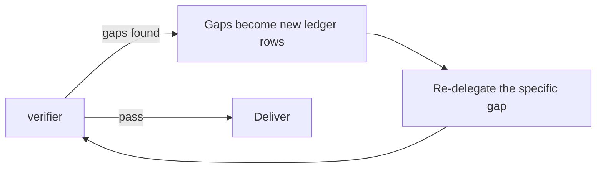

# Phase 7: verify

Done is not a feeling. It is a gate, and this is the gate.

## The launch

`supercook-verifier` gets fresh context and nothing else:

- `plan.md`
- the ledger
- the diff
- the test command

Not the implementation history, not the reasoning, not the agent conversations. The absence is the point: a verifier that watched the code get written can be talked into believing it works. One that only sees the plan and the diff cannot.

## What it checks

1. **Every plan row**: landed, missing, or partial, each with evidence and a file citation.
2. **The suite, actually run.** It executes the recorded command and quotes real output. A verdict reasoned from the diff alone gets rejected and re-run, because green tests cannot be inferred.
3. **Out of scope**: anything in the diff no plan slice asked for. A stray refactor, a reformatted file, a changed dependency.
4. **Tests untouched**: any test file in the diff that was not part of the deliberate test-first commit. This is a serious finding.

## The parent's job after it returns

Confirm fresh test output is quoted. No output means re-run rather than accept. This is the one place where being lenient defeats the entire arrangement.

Also check the `tests` line. `MODIFIED` there means a test file changed outside the deliberate test-first commit, so the test-integrity guard in [implementation.md](implementation.md#the-guards) either did not run or ran after a commit. Restore the file, log it, and find out which.

## Timing on multi-slice work

The verifier runs **before each slice's PR opens**, checking that slice's plan rows against that slice's diff. Then a **final pass** at the end confirms the whole plan landed and nothing fell between the slices.

Verifying only at the end means shipping three PRs and finding out afterwards that slice 1 missed half its plan.

## The gap loop

Gaps become new ledger rows with the file and the missing behavior named. Then re-delegate the specific gap, not the whole slice.

**The escape rule.** A chunk that drifted badly or failed the verifier twice does not get a third patch. Revert it, amend the plan, log the amendment, and re-delegate from the amended plan. Fix on fix produces a diff nobody can review and behavior nobody can explain.

**Done cannot be declared until the verdict is pass.** Not "the tests looked green earlier", not "the last chunk was straightforward". Pass, with quoted output.

## Blocked

`verdict: blocked` means the suite could not run at all. That is a real finding, not a failure to verify. Report the command and the error, fix the environment problem if it is in scope, and re-run. Never substitute an invented command that happens to succeed.
