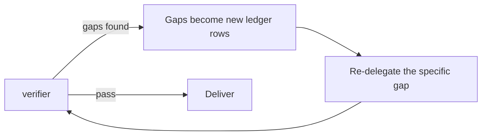

# Phase 7: verify

Done is not a feeling. It is a gate, and this is the gate.

## The launch

`supercook-verifier` gets fresh context and nothing else:

- `plan.md`
- the ledger
- the diff
- the test command or recorded executable verification recipe plus its ledger checksum

Not the implementation history, not the reasoning, not the agent conversations. The absence is the point: a verifier that watched the code get written can be talked into believing it works. One that only sees the plan and the diff cannot.

For an open-pr UI run with no `plan.md`, pass the retrospective UI contract from
the ledger in its place. The verifier still receives a contract, never an
unstructured design link.

## What it checks

1. **Every contract row**: each plan row, or each retrospective ledger row on
   open-pr, is landed, missing, or partial with evidence and a file citation.
2. **The recorded verification, actually run.** It executes the test command or
   recipe and quotes real output. A verdict reasoned from the diff alone gets
   rejected and re-run because a pass cannot be inferred.
3. **Out of scope**: anything in the diff no plan slice asked for. On open-pr, use
   the task plus the ledger's initial diff inventory and deliberate retrospective
   tests as the scope baseline. A later stray refactor, reformatted file, or changed
   dependency is still a finding.
4. **Tests untouched**: any test file in the diff that was not part of a deliberate
   test-designer commit, red-first or retrospective. This is a serious finding.
5. **Explanations name real code.** A PR body, ledger row, or commit message that describes the work without naming a file, or that asserts a benefit with no consequence attached, is a finding like any other. "Improved error handling" and "for robustness" are the shapes to catch. This is the enforcement arm of the first principle in `SKILL.md`, and without a check here that principle is only a suggestion.
6. **UI contract, when present.** Each slice's owned regions, anchors, counts,
   semantic containment, and interactions landed in source and verification. The
   global logical order landed on its named owner. Any unapproved deviation is a
   finding. The return says
   `ui-contract: ok` or names the mismatch.

The verifier is structural. It never returns `visual: ok`, because it does not
render the route. A green suite cannot excuse a wrong section order or a missing
designed region.

## The parent's job after it returns

Confirm fresh test or recipe output is quoted. No output means re-run rather than
accept. This is the one place where being lenient defeats the entire arrangement.
For a recipe, also confirm the verifier quoted the checksum match. A mismatch is
`gaps found`, not a runnable substitute.

For a contract-level UI slice, also confirm the return contains `ui-contract: ok`.
A mismatch is `gaps found` even when every non-UI journey passes. After structural
pass, the parent runs the rendered-smoke row from
[ui.md](ui.md#rendered-smoke). Structural verification cannot close that row.

Also check the `tests` line. `MODIFIED` there means a test file changed outside the deliberate test-first commit, so the test-integrity guard in [implementation.md](implementation.md#the-guards) either did not run or ran after a commit. Restore the file, log it, and find out which.

## Timing on multi-slice work

The verifier runs **before each slice's PR opens**, checking that slice's plan rows against that slice's diff. The parent then runs that slice's rendered smoke. A PR cannot open with an open or failed smoke row. Then a **final pass** and composed-page smoke at the end confirm the whole plan landed and nothing fell between the slices.

Verifying only at the end means shipping three PRs and finding out afterwards that slice 1 missed half its plan.

## The gap loop

```mermaid
flowchart LR
    verify["verifier"] -->|"gaps found"| rows["Gaps become new ledger rows"]
    rows --> impl["Re-delegate the specific gap"]
    impl --> verify
    verify -->|"pass"| deliver["Deliver"]
```

Gaps become new ledger rows with the file and the missing behavior named. Then re-delegate the specific gap, not the whole slice.

A rendered-smoke failure enters the same loop. Record what the parent actually saw,
re-delegate the smallest source gap, rerun structural verification when relevant,
then rerun the smoke. Only missing render capability can become
sanctioned-blocked; a route that rendered incorrectly cannot.

**The escape rule.** A chunk that drifted badly or failed the verifier twice does not get a third patch. Revert it, amend the plan, log the amendment, and re-delegate from the amended plan. Fix on fix produces a diff nobody can review and behavior nobody can explain.

**Done cannot be declared until the verdict is pass.** Not "the tests looked green
earlier", not "the recipe should work", not "the last chunk was straightforward".
Pass, with quoted output.

## Blocked

`verdict: blocked` means the recorded tests or recipe could not run at all. That is
a real finding, not a failure to verify. Report the command and the error, fix the
environment problem if it is in scope, and re-run. Never substitute an invented
command that happens to succeed.
